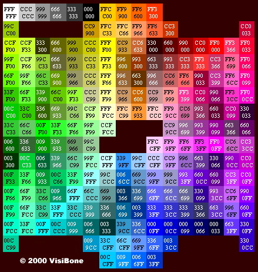
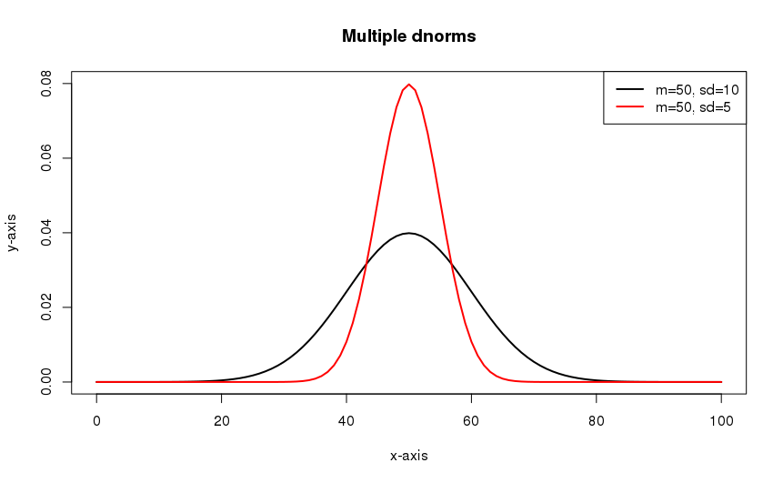
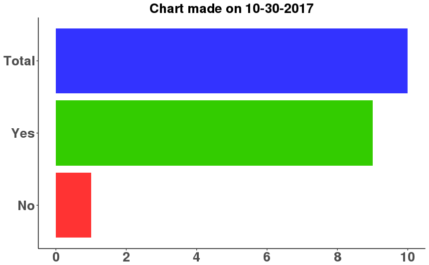
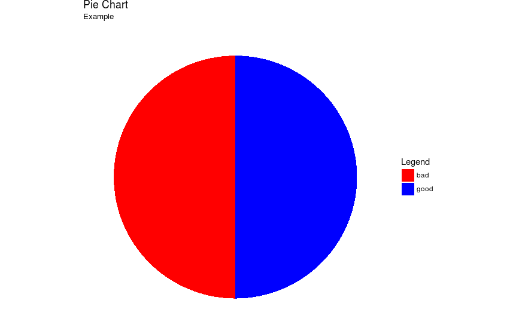
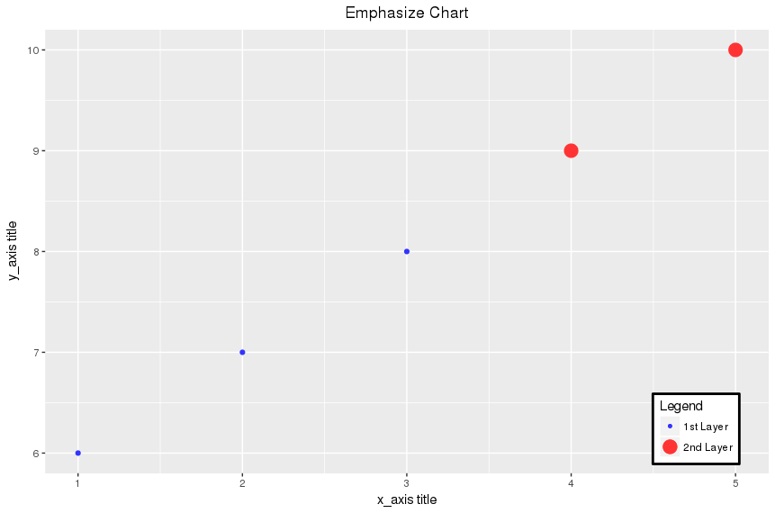

# Contents

- [Hexidecimal colors](https://github.com/smatsushima1/home/wiki/R#hexidecimal-colors)
- [Multiple dnorms on same graph](https://github.com/smatsushima1/home/wiki/R#multiple-dnorms-on-same-graph)
- [Horizontal bar graph](https://github.com/smatsushima1/home/wiki/R#horizontal-bar-graph)
- [Pie chart](https://github.com/smatsushima1/home/wiki/R#pie-chart)
- [Emphasizing specific plot points](https://github.com/smatsushima1/home/wiki/R#emphasizing-specific-plot-points)

---

# Hexidecimal colors



---

# Multiple dnorms on same graph

```r
x <- 0:100
plot(x,
     dnorm(x, 50, 10),
     type="l",
     lwd=2,
     xlab="x-axis",
     ylab="y-axis",
     ylim=c(0, .08), 
     main="Multiple dnorms")
lines(x,
      dnorm(x, 50, 5),
      type="l",
      lwd=2,
      col="red")
legend("topright",
       c("m=50, sd=10", "m=50, sd=5"),
       lty=c(1, 1),
       lwd=c(2, 2),
       col=c("black", "red"))
```



---

# Horizontal bar graph

```r
library(ggplot2)
library(scales)

no <- 1

yes <- 9

total <- no + yes

sys_date <- Sys.Date()
sys_date <- format(sys_date, format = "%m-%d-%Y")

chart_title <- "Chart made on"
chart_title <- paste(chart_title, sys_date)

df <- data.frame(x_axis = c("No", "Yes", "Total"),
                 y_axis = c(no, yes, total))

ggplot(data = df, aes(x = x_axis, y = y_axis, fill = x_axis)) +
  geom_bar(stat = "identity") +
  ggtitle(chart_title) +
  coord_flip() +
  scale_y_continuous(breaks = pretty_breaks()) +
  scale_fill_manual(values = c("#FF3333", "#3333FF", "#33CC00")) +
  scale_x_discrete(limits = c("No", "Yes", "Total")) +
  theme_classic() +
  theme(legend.position = "none",
        axis.title.x = element_blank(),
        axis.title.y = element_blank(),
        axis.text.x = element_text(face = "bold", size = 20),
        axis.text.y = element_text(face = "bold", size = 20),
        plot.title = element_text(face = "bold", size = 20, hjust = 0.5))
```



---

# Pie chart

```r
library(ggplot2)
library(scales)

x <- 2

df <- data.frame(x_axis = c("good", "bad"),
                 y_axis = c(100, 0))

ggplot(data = df, aes(x = "", y = y_axis, fill = x_axis)) +
  geom_bar(width = 1, stat = "identity") +
  coord_polar("y", start = 0) +
  scale_fill_manual(values = ifelse(x == 2, c("#3333FF", "#33CC00"), c("#FF3333", "#33CC00")))
```



---

# Emphasizing specific plot points

*Override plot points to add size and emphasis to others*

```r
library(ggplot2)
library(scales)

df <- data.frame(x_axis = 1:5,
                  y_axis = 6:10,
                  value = "blue", "blue", "blue", "blue", "blue")

df2 <- data.frame(x_axis = 4:5,
                  y_axis = 9:10,
                  value = "red", "red")

ggplot(data = df, aes(x = x_axis, y = y_axis, color = value)) +
  geom_point() +
  geom_point(data = df2, aes(x = x_axis, y = y_axis), size = 5) +
  labs(title = "Emphasize Chart", x = "x_axis title", y = "y_axis title", color = "Legend") +
  scale_color_manual(values = c("#3333FF", "#FF3333"),
                     labels = c("1st Layer", "2nd Layer")) +
  theme(legend.position = c(.10, .90),
        legend.background = element_rect(color = "black", size = 1),
        plot.title = element_text(hjust = 0.5)) +
  guides(color = guide_legend(override.aes = list(size = c(1, 5))))
```



